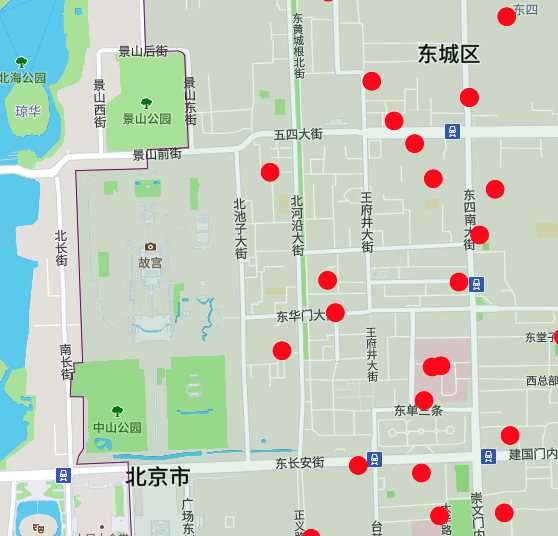

# bj-hospital-vis

> 北京社保定点医院-可视化

## Links

- GitHub https://github.com/magicdawn/bj-hospital-vis
- Page https://bj-hospital-vis.netlify.com/#/

## 数据来源

- 北京行政区 & 医院地理位置来源: amap.com
- 医院列表: http://ybj.beijing.gov.cn/ddyy/ddyy/list?search_LIKE_yymc=&page=1&sortType=

## Tech Stack

- vue / vue-router
- mapbox-gl & vue-mgl
- vue-ant-design
- 高德开放平台

## 背景

- 想换一下医保定点医院, 然后找起来太麻烦.
- 然后自己 <del>这</del>前两年 刚好干的就是类似的
- 然后刚好总结一下, 内部用的 vue mapbox-gl wrapper 是之前留下来的, 自认没有这个 vue-mgl 好 😂
- 然后先写 vue-mgl, 后写这个

## Interesting part

### 故宫

故宫划到了东城区

### 朝阳区

- 朝阳区是个 MultiPolygon
- 首都国际机场机场是一个单独的 Polygon
- 然后只划了一部分,不造为啥...

